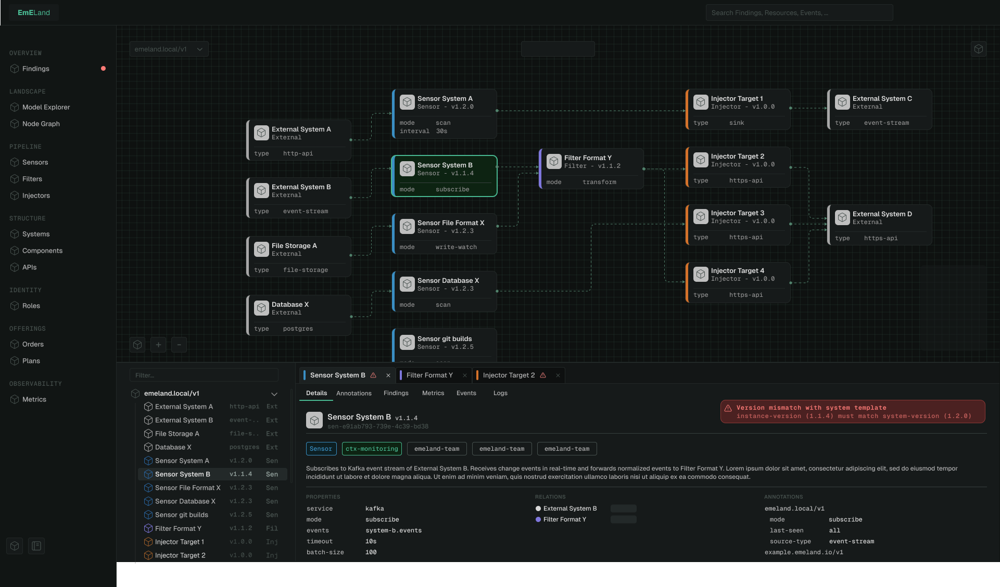
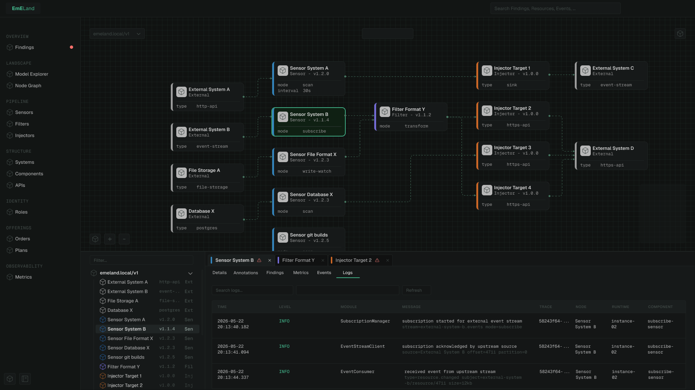

# UI Design Drafts

This directory contains the initial UI design drafts for EmELand.

The designs represent early concepts and explorations of the user experience, navigation structure, visual language and specific views such as the Base Layout and Node Graph. They are intended to guide implementation and help align design decisions before and during frontend development.

> **Work in Progress:** These drafts will evolve over time. Screens, interactions, visual details and workflows may change as the product matures. The frontend implementation is being built based on these designs and may not yet fully match the latest drafts.

## Base Layout

The initial application shell defining the overall structure of EmELand, including sidebar navigation, topbar, search and content area.

---

## Node Graph

Node graph exploration view with a focused inspector panel showing node metadata, relationships and contextual details.

### Node Graph – Logs

Node graph view with operational log inspection for selected nodes.

### Node Graph – Events

Node graph view with event inspection and event flow exploration capabilities.

---

## Purpose

These drafts serve as the current design reference for frontend implementation. They help establish the overall visual language, navigation concepts, layout structure and interaction patterns of EmELand before more detailed specifications and a formal design system are introduced.

The screenshots currently focus on dark theme. A corresponding light theme will be developed alongside implementation.
