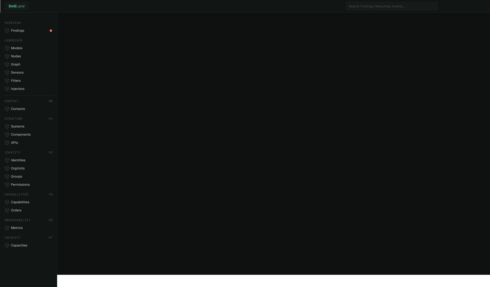
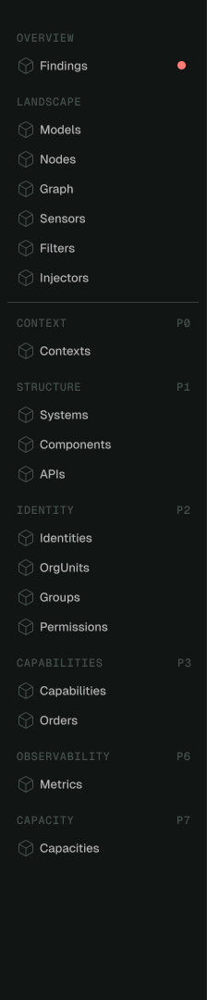
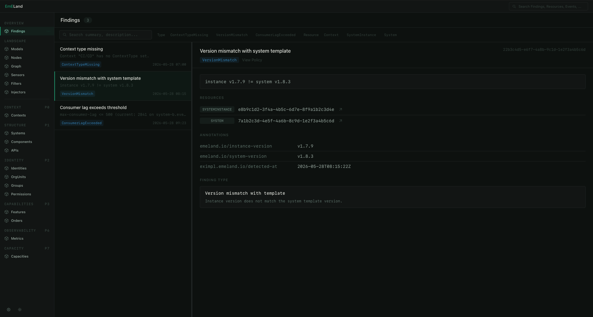
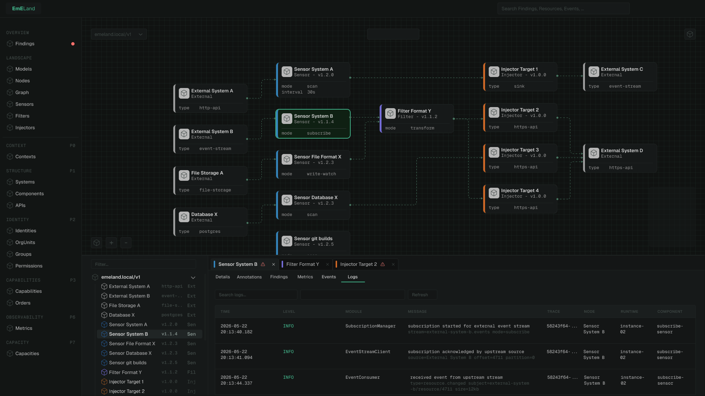
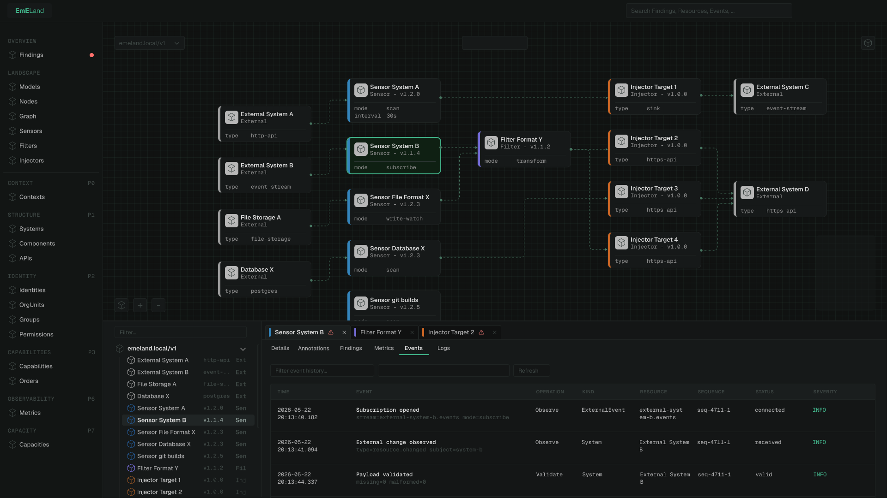

# UI Design Drafts

This directory contains the initial UI design drafts for EmELand.

The designs represent early concepts and explorations of the user experience, navigation structure, visual language and specific views such as the Base Layout and Node Graph. They are intended to guide implementation and help align design decisions before and during frontend development.

> **Work in Progress:** These drafts will evolve over time. Screens, interactions, visual details and workflows may change as the product matures. The frontend implementation is being built based on these designs and may not yet fully match the latest drafts.

## Base Layout

The initial application shell defining the overall structure of EmELand, including sidebar navigation, topbar, search and content area.

### Sidebar

Sidebar is structured in two parts: a header section (Overview, Landscape) and phases section below the divider listing the book phases.

In the future, the phase sections could be made collapsible, this depends on how many resources each phase will eventually contain, which is not fully known yet. If the growing number of items starts to affect navigation usability, we'll revisit the phase section UX.

---

## Findings

Findings view for monitoring detected conditions in the landscape model,  referential integrity violations, missing relationships or policy rule violations surfaced by filters.

#### Layout

The view uses a list-detail layout: a resizable finding list on the left and a detail panel on the right. Selecting a finding displays its full description, affected resources, annotations and finding type information.

#### Filtering

Findings can be filtered by finding type and resource type directly from the toolbar. The search input matches against summary and description. Filter buttons show an overflow menu (`+N`) when there are more options than fit inline, with a visual indicator if a hidden filter is active.

#### Severity

Severity is not part of the EmELand model. Annotations should be used.

## Node Graph

Node graph exploration view with a focused inspector panel showing node metadata, relationships and contextual details.

### Node Graph – Logs

Node graph view with operational log inspection for selected nodes.

### Node Graph – Events

Node graph view with event inspection and event flow exploration capabilities.

---

## Purpose

These drafts serve as the current design reference for frontend implementation. They help establish the overall visual language, navigation concepts, layout structure and interaction patterns of EmELand before more detailed specifications and a formal design system are introduced.

The screenshots currently focus on dark theme. A corresponding light theme will be developed alongside implementation.
